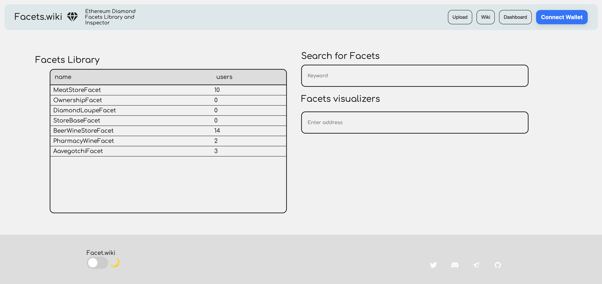
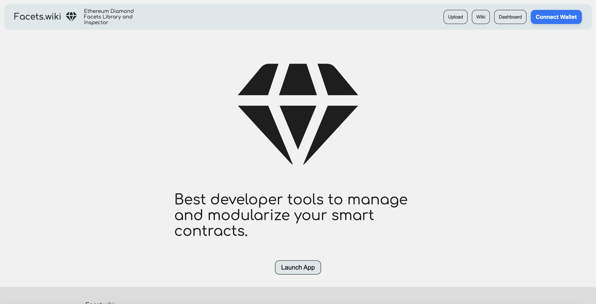
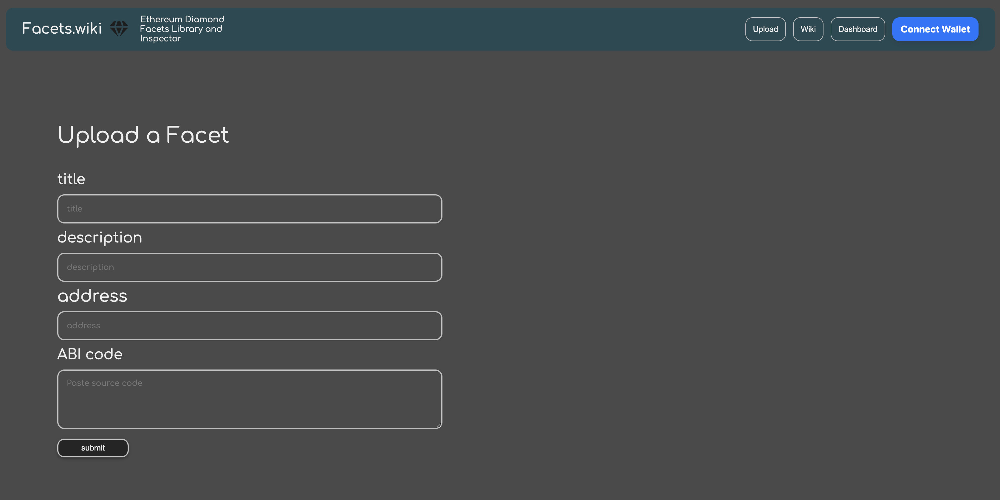
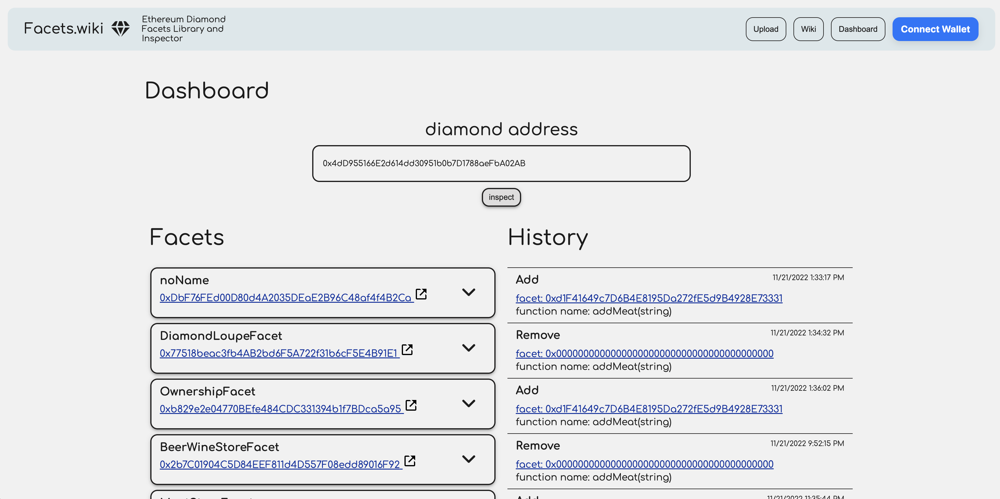
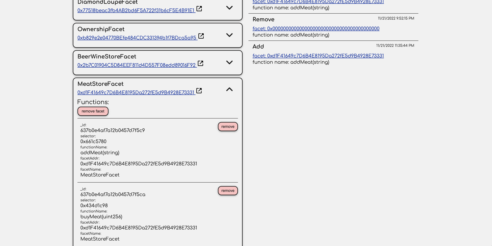
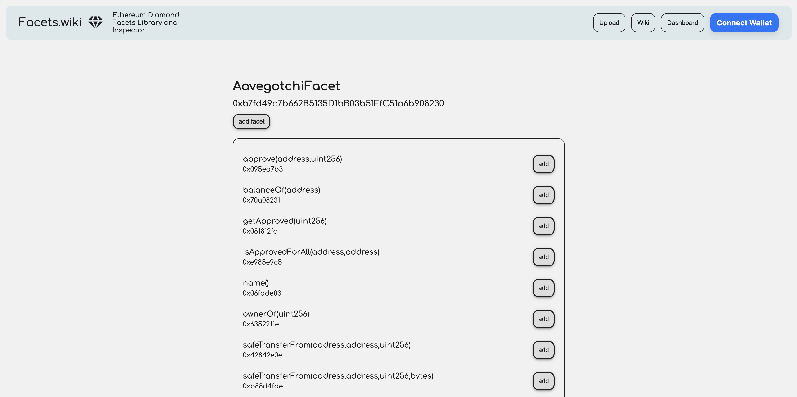

# facets.wiki

live demo: https://facets.wiki
Github back-end repo : https://github.com/jrcarlos2000/eth-vietnam-backend
Github contracts repo : https://github.com/jrcarlos2000/eth-vietnam-contracts

### ETHVietnam Winning Submission

[Link to Dora Hacks page](https://dorahacks.io/buidl/3887)

# GitHub Repos

Front end:

https://github.com/jrcarlos2000/eth-vietnam-frontend

Back end:

https://github.com/jrcarlos2000/eth-vietnam-backend

Smart Contracts:

https://github.com/jrcarlos2000/eth-vietnam-contracts

# About:

Facets Wiki is a developer tool that allows users to :

1. Inspect and manage diamonds
2. Add audited facets to our database
3. Add deployed facets to their diamonds
4. Add / Delete functions from their diamonds.
5. Facets Wiki makes it easier for developers to get acquainted with the Diamond Proxy and contract system.

# demo video
https://vimeo.com/773582434

# screenshots

### home page

### landing page

### upload facet page

### inspector page

### inspector facets

### facet detail page

# Figma
https://www.figma.com/file/eeAsEiEKwaUWSNCOZ2150V/Untitled?node-id=0%3A1&t=ot6CUWB7QHwrHZDD-1

